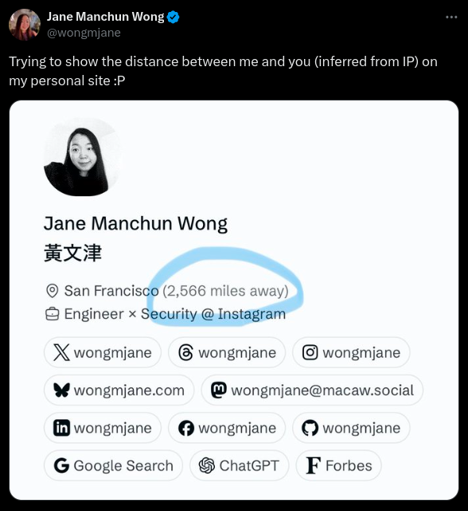

## Todo

- [ ] Add section for food images in the website
- [ ] Add section for travel images in the website
- [ ] Add section for engineering journey

  > [6:28 pm, 10/6/2024] Kartik: make a page of engineering journey
  > [6:28 pm, 10/6/2024] Kartik: experience
  > [6:28 pm, 10/6/2024] Kartik: with photos and informal wayy

- [ ] Something unique like this, [twitter.com/wongmjane](https://x.com/wongmjane)
      
- [ ] Make last edited with blogs with GitHub and markdown and all
- [ ] Add a section for the books I read
- [ ] Add a section for the movies I watched
- [ ] Add a section for the series I watched
- [ ] Add a section for the podcasts I listened to
- [ ] Add a section for the music I listened to
- [ ] Add a section for the games I played
- [ ] Add a section for the people I met
- [ ] Add a section for the places I visited
- [ ] Add a section for the food I ate
- [ ] Add a section for the things I bought
- [ ] Add a section for the things I learned
- [ ] Add a section for the things I built
- [ ] Add a section for the things I wrote
- [ ] Add a section for the things I drew
- [ ] Add a section for the things I designed
- [ ] Add a section for the things I coded
- [ ] Make a tracker of countries you've traveled to
- [ ] add typing indicator in the website from typeracer and monkeytype
- [ ] https://isora.me/tools/ - add this in the tools section
